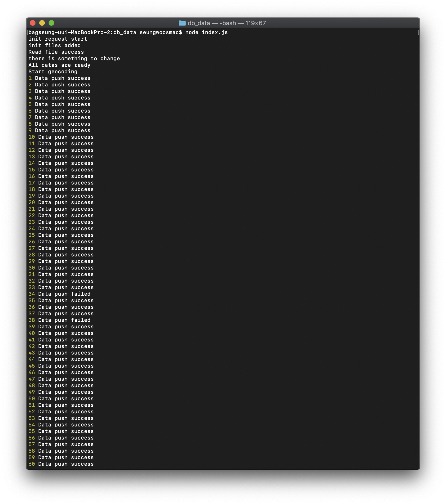

# Processing SafeRestaurant data save

## Used modules

> - fs
> - sync-request

## Execution screen

> 

## Description

> 1. Get all safe restaurant datas
> 2. Geocoded their Korean addresses.
> 3. Gather all necessary datas.
> 4. Save datas in data.json, errdatas.

## To do

> 1. Modify some codes for only appending additional datas instead of initializing files
> 2. Find a way to geocode datas in errdata.json.
