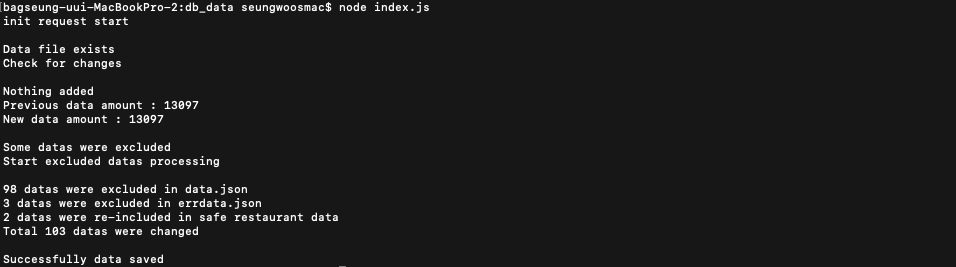

# Auto detect changes in safe restaurant data and save

## Used modules

> - fs
> - sync-request

## Execution screen

> - First procedure (get all datas)
>   
>
> - Add modified datas (new data)
>   
>
> - Nothing changed
>   
>
> - Excluded, Re-included data process
>   

## Description

> 1. Find data.json and errdata.json files.
>
> - Exist
>   1. Detect if there are additional, excluded datas in api.
>      - Changed
>        1. Get only additional datas.
>        2. Geocode them and save.
>        3. Find out if there are any excluded or re-included data and process them.
>      - Nothing changed
>        1. Notice user there isn't any additional datas.
>        2. Find out if there are any excluded or re-included data and process them.
> - Not exist
>   1. Get all safe restaurant datas.
>   2. Geocode them and save.

## To do

> 1. Find out how to geocode datas in errdata.json.
