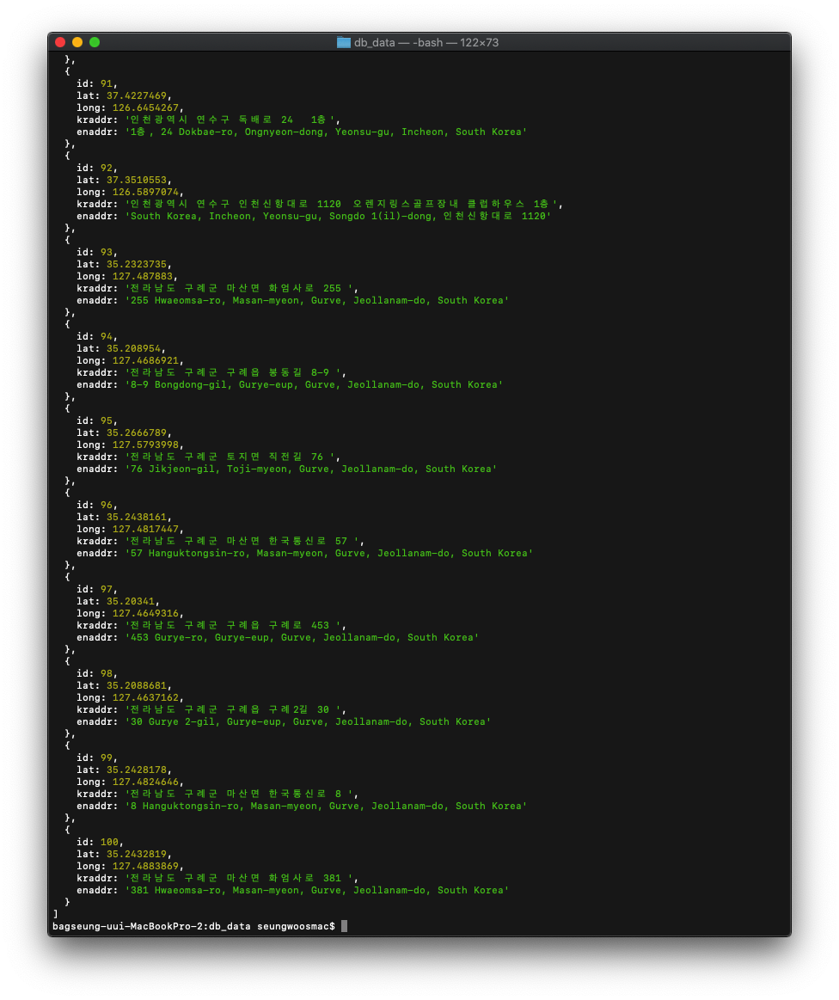

# Processing SafeRestaurant data

## Used modules

> - node-fetch
> - node-geocoder

## execution screen

> 

## description

> 1. Got 100 sample datas.
> 2. Geocoded their Korean addresses.
> 3. Gather all necessary datas.
> 4. Lastly, showed them on console screen
