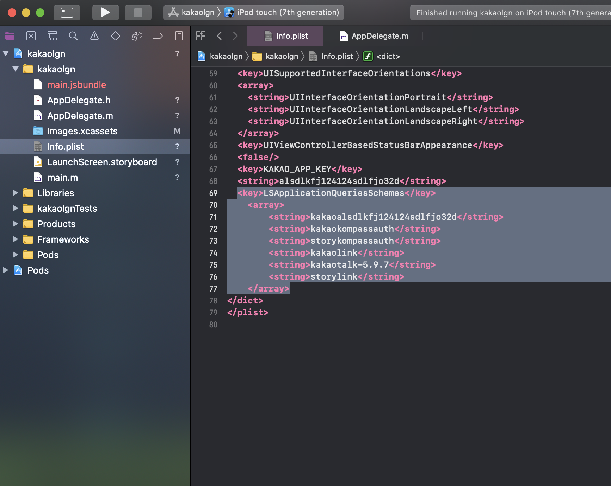

# 카카오 로그인, 카카오 공유(안드로이드 버전)

> ## 기본 세팅
>
> > ### 카카오 개발자 사이트 어플리케이션 생성
> >
> > 1. 플랫폼으로 이동해서 안드로이드 플랫폼 등록
> >    > 1. android/.../AndroidManifest.xml 파일에서 패키지명 얻어오기
> >    > 2. 패키지명에 얻어온 패키지명 입력<br/><br/>
> >    > 3. project dir에서 cmd(terminal)에서 안드로이드 키 해시 값 가져오기
> >    >    > - window
> >    >    >
> >    >    > ```cmd
> >    >    >  keytool -exportcert -alias androiddebugkey -keystore android\app\debug.keystore -storepass android -keypass android | openssl sha1 -binary | openssl base64
> >    >    > ```
> >    >    >
> >    >    > - mac
> >    >    >
> >    >    > ```shell
> >    >    >  keytool -exportcert -alias androiddebugkey -keystore ./android/app/debug.keystore -storepass android -keypass android | openssl sha1 -binary | openssl base64
> >    >    > ```
> >    >    >
> >    >    > 이렇게 해서 나온 값을 복사해서 붙여넣기
> >    >    > <br/>
> >    > 4. 카카오 로그인 메뉴에서 로그인 활성화<br/>
> >    > 5. 동의 항목 메뉴에서 아래쪽 메시지 전송 권환 활성화<br/>
> > 2. AndroidManifest.xml 파일의 allowBackup 부분을 true로 변경
> >    <br/>
> > 3. ./android/build.gradle 파일의 마지막에 이 줄 복붙
> >
> > ```gradle
> >  ...
> >  repositories {
> >      ...
> >      maven { url 'http://devrepo.kakao.com:8088/nexus/content/groups/public/' }
> >  }
> > ```
> >
> > 4.  ./android/app/src/main/res/values/strings.xml 파일에 이 줄 추가
> >
> > ```xml
> >  <resources>
> >    ...
> >    <string name="kakao_app_key">native app key</string>
> >  </resources>
> > ```
> >
> > 여기서 native app key는 이전에 생성한 카카오 개발자 사이트 어플리케이션의 앱 키 부분의 네이티브 앱키를 복붙<br/><br/>

> # 모듈 다운, 구현
>
> > - install
> >
> > ```cmd
> >  npm install --save @react-native-seoul/kakao-login
> >  npm install --save react-native-kakao-links
> > ```
> >
> > - 구현
> >   - 참고 사이트
> >     > [react-native-kakao-links](https://github.com/shpongle2634/react-native-kakao-links)<br>[kakao-login](https://github.com/react-native-seoul/react-native-kakao-login)
> >   - 로그인
> >
> > ```javascript
> >  import Kakaologins from '@react-native-seoul/kakao-login';
> >  ...
> >  _kakaologinfunc = () => {
> >     Kakaologins.login()
> >      .then((res) => {
> >        console.log(res.accessToken);
> >        this.setState({
> >          Tocken: res.accessToken,
> >        });
> >      })
> >      .catch((err) => {
> >        console.log('login failed');
> >        console.log(err);
> >      });
> >  };
> > ```
> >
> > 이런식으로 함수를 만들어 onPress 콜백함수로 등록 하는등 구현하면 토큰 값을 받아올 수 있음
> > 추가로 로그아웃, 연결 끊기, 프로필 정보 가져오기 등의 기능도 있음
> >
> > - 공유
> >
> > ```javascript
> >  import RNKakaoLink from 'react-native-kakao-links';
> >  ...
> >  _kakaolink = async () => {
> >      console.log('share');
> >      try {
> >        const options = {
> >          objectType: 'location', //required
> >          content: {
> >            title: 'location', //required
> >            link: {
> >              webURL: 'https://developers.kakao.com',
> >              mobileWebURL: 'https://developers.kakao.com',
> >            }, //required
> >            imageURL: 'https://i.stack.imgur.com/lQQjg.png', //required
> >          }, //required
> >          address: '인천 광역시 부평구 일신동 12-24',
> >          addressTitle: 'My house',
> >        };
> >        const mes = await RNKakaoLink.link(options);
> >        console.log(mes);
> >      } catch (e) {
> >        console.warn(e);
> >      }
> >    };
> > ```
> >
> > options부분은 links 참고 사이트를 통해 확인 후 템플릿 변경 가능<br>
> > 추가적인 부분은 App.js 확인<br>
> > ios는 로그인까진 성공했지만 공유 기능은 시간나면 작업할 예정<br>

> # 로그인(ios)

> ### execution screen
>
> <br />

## How to use it

> - install module
>
> ```shell
>  yarn add @react-native-seoul/kakao-login
>  or
>  npm install --save @react-native-seoul/kakao-login
> ```

> - enroll new application in your kakao developer account

> ### ios setup
>
> > - auto linking
> >
> > ```shell
> >  cd ios && pod install && cd ..
> > ```

> > - setup in projectname.xcworkspace file
> >   1. open project_directory/ios/projectname.xcworkspace
> >   2. go to URL types and add kakao{your native app key} in URL Schemes
> >      > <br />
> >      > key in this picture is fake key that I made randomly
> >   3. add app key in info.plist
> >      > <br />
> >   4. add some lists in info.plist
> >      > <br />
> >      > right mouse click info.plist file and open as source code
> >   5. open projectdir/ios/projectname/AppDelegate.m file
> >      > <br />
> >      > add these lines
> >      >
> >      > ```objective-c
> >      >  #import <KakaoOpenSDK/KakaoOpenSDK.h>
> >      >  ...
> >      >  @implementation AppDelegate
> >      >  ...
> >      >  - (BOOL)application:(UIApplication *)application openURL:(NSURL *)url sourceApplication:(NSString *)sourceApplication annotation:(id)annotation {
> >      >      if ([KOSession isKakaoAccountLoginCallback:url]) {
> >      >          return [KOSession handleOpenURL:url];
> >      >      }
> >      >      return false;
> >      >  }
> >      >  - (BOOL)application:(UIApplication *)application openURL:(NSURL *)url options:> >      >  (NSDictionary<NSString *,id> *)options {
> >      >      if ([KOSession isKakaoAccountLoginCallback:url]) {
> >      >          return [KOSession handleOpenURL:url];
> >      >      }
> >      >      return false;
> >      >  }
> >      >  - (void)applicationDidBecomeActive:(UIApplication *)application {
> >      >      [KOSession handleDidBecomeActive];
> >      >  }
> >      > ```
