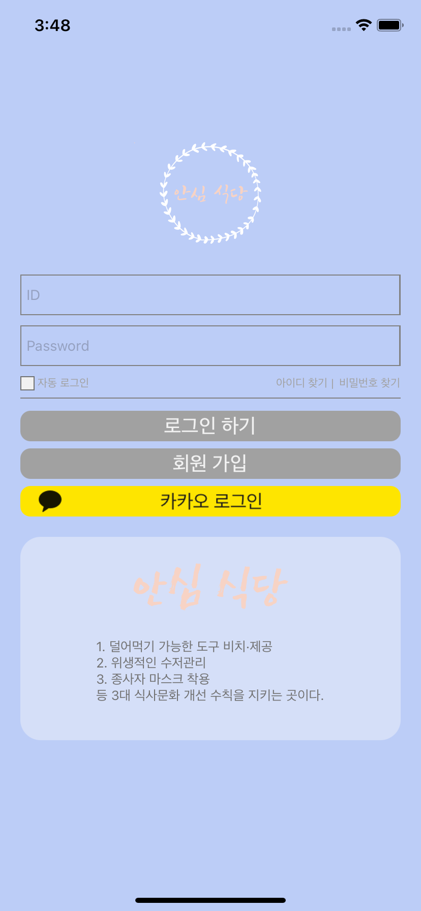
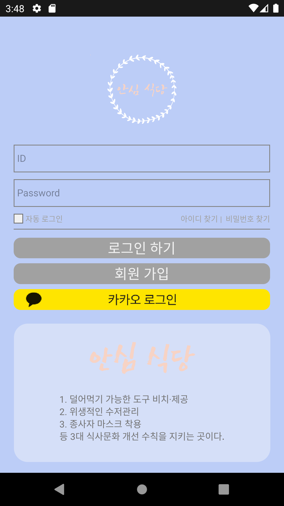

# 안심 식당앱 로그인 화면입니다

## 사용 모듈

> - @react-native-community/geolocation
> - prop-types
> - react-native-maps
> - **로그인 화면만 볼 시 이 모듈들은 필요없음**

## 실행 화면

> - 아이폰
>
>   
>
> - 안드로이드
>
>   

## ToDo

> 1. 실제 로그인 기능 구현 (백엔드와 연결)
