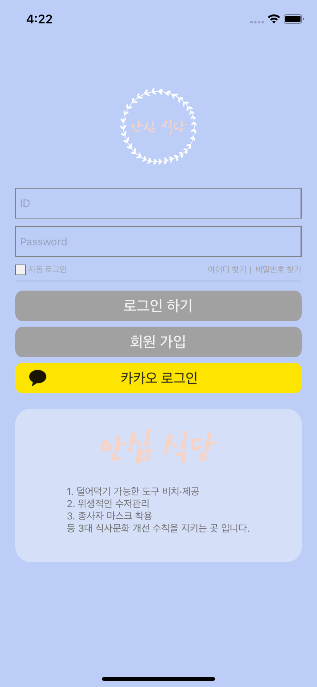
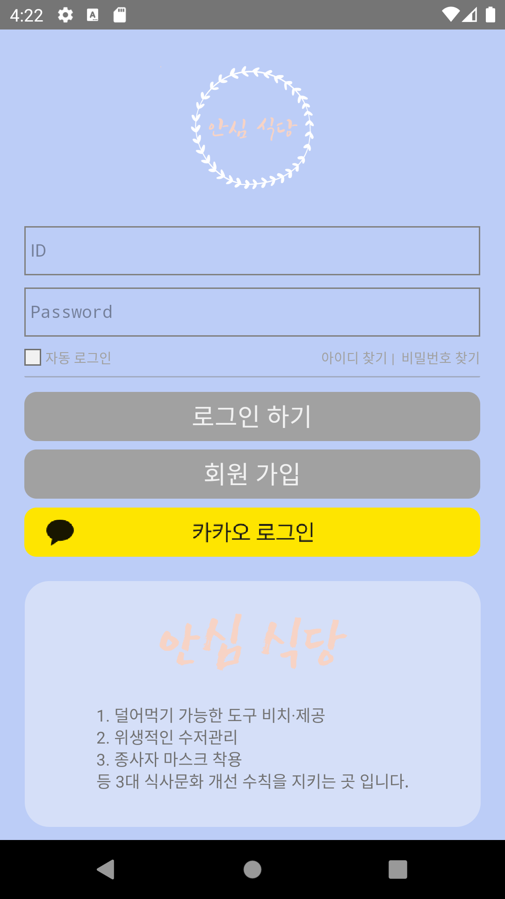
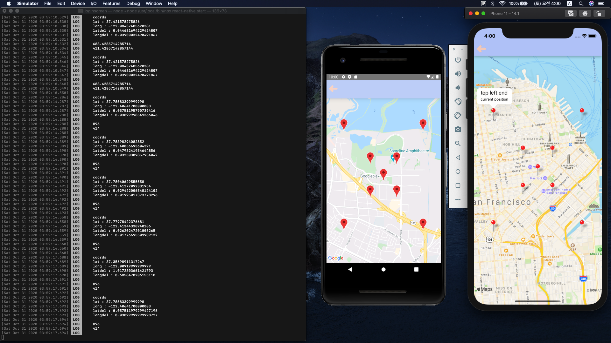

# 안심 식당앱 로그인 화면입니다

## 사용 모듈

> - @react-native-community/geolocation
> - react-native-maps

## 실행 화면

> - 아이폰
>
>   
>
> - 안드로이드
>
>   

## set virtual screen range

> ### execution screen
>
> 
>
> 1. central marker means the center of the screen 
> 2. inner 4 markers mean the size of current screen 
>    (in this picture I adjusted delta values to see all markers, and there are some problems in latdelta value) 
> 3. outer 4 markers mean the range (we only wanna retrieve datas in this range)

## ToDo

> 1. 실제 로그인 기능 구현 (백엔드와 연결)
